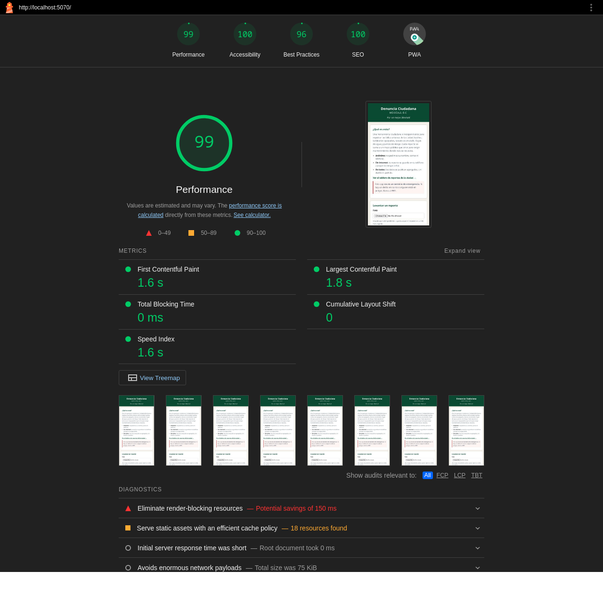
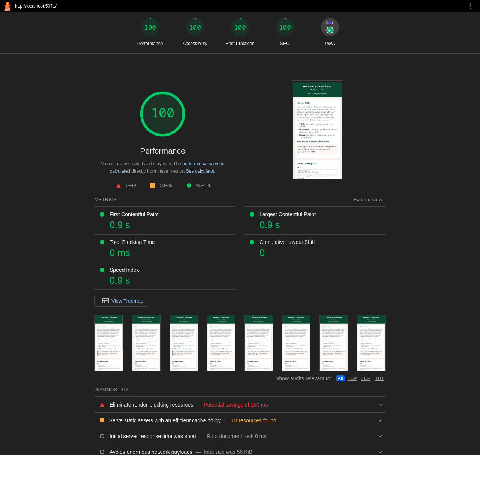

# REPORTE DE AUDITORÍA LIGHTHOUSE

**Aplicación:** Denuncia Ciudadana Mexicali, B.C. (PWA)
**Página auditada:** página de inicio (`/`, el `start_url` del manifest)

**Método:**
- **Herramienta:** Lighthouse 11.7.1 con Chrome 124. Es la última versión de Lighthouse que todavía incluye la categoría PWA; a partir de la 12 esa categoría ya no existe.
- **Perfil:** celular, con la simulación de red y CPU que Lighthouse trae por defecto.
- **Servidor:** la app se sirvió en local con `serve`, el servidor estático de Vercel, que comprime las respuestas igual que en producción.
- **Corridas:** tres por versión, sin otros procesos en paralelo. Los puntajes son la mediana. Performance varía de una corrida a otra, y con una sola medición la comparación no es confiable.
- **Nota sobre PWA:** en el reporte HTML, Lighthouse 11 muestra la categoría PWA como una insignia; el puntaje numérico sale del JSON del mismo reporte.


## RESULTADOS INICIALES

Fecha: 13 de septiembre de 2026

| Categoría | Puntaje | Corridas |
|---|---|---|
| Performance | **99** | 95, 99, 99 |
| Accesibilidad | **100** | 100, 100, 100 |
| Buenas Prácticas | **96** | 96, 96, 96 |
| SEO | **100** | 100, 100, 100 |
| PWA | **88** | 88, 88, 88 |


## PROBLEMAS IDENTIFICADOS

1. **Error en la consola: `/favicon.ico` responde 404** *(Buenas Prácticas)*.
   La página no declaraba un favicon, así que el navegador lo pedía en la ruta
   por defecto, que no existe. Lighthouse lo registra como error de consola.

2. **El manifest no tiene un ícono *maskable*** *(PWA)*.
   Android recorta el ícono de las apps instaladas con distintas formas
   (círculo, gota, cuadrado redondeado). Sin un ícono con zona segura, el sistema
   reduce el ícono normal y lo pone sobre un fondo blanco.

3. **Íconos temporales e inconsistentes** *(no lo marca Lighthouse; se encontró
   al revisar el manifest durante la auditoría)*.
   Los dos íconos eran provisionales desde la sesión 1: el declarado como
   `512x512` medía en realidad 900×900 y traía el cuadriculado de
   "transparencia" dibujado dentro de la imagen, y el de 192 era un dibujo
   distinto. Además, el `theme_color` del manifest seguía en negro (`#000000`)
   aunque la página usa el verde `#0f5132`.

4. **CSS que bloquea el renderizado** *(Performance, oportunidad de ~150 ms)*.
   `style.css` se carga en el `<head>` antes de pintar.

5. **Recursos estáticos sin política de caché larga** *(Performance, 18 recursos)*.
   Los módulos JS y el CSS se sirven sin `Cache-Control` de larga duración.

Los problemas 4 y 5 **no se corrigieron, a propósito**:

- **CSS bloqueante:** Performance ya está en 100. Separar un CSS "crítico" en línea
  del resto complicaría el mantenimiento a cambio de una ganancia que solo existe
  en la simulación.
- **Caché:** los archivos no llevan huella en el nombre (`app.js`, no
  `app.3f9a.js`). Con una caché de meses, quien ya visitó la app se quedaría con
  versiones viejas después de cada despliegue. La caché sin conexión ya la cubre
  el service worker, que tiene versión y se renueva al actualizar.


## CORRECCIONES APLICADAS

### Corrección 1 — Favicon declarado (resuelve el problema 1)

**Archivos modificados:** `index.html`, `img/icono-192.png` (nuevo),
`img/apple-touch-icon.png` (nuevo), `service-worker.js`

**Antes** (`index.html`):
```html
<link rel="manifest" href="/manifest.json">
<link rel="stylesheet" href="style.css">
```

**Después** (`index.html`):
```html
<link rel="manifest" href="/manifest.json">
<link rel="icon" type="image/png" href="img/icono-192.png">
<link rel="apple-touch-icon" href="img/apple-touch-icon.png">
<link rel="stylesheet" href="style.css">
```

Con el favicon declarado, el navegador ya no pide `/favicon.ico` y desaparece el
404. El `apple-touch-icon` es el ícono que usa iOS al agregar la app a la
pantalla de inicio. En `service-worker.js` la versión de la caché subió de
`denuncia-v12` a `denuncia-v13`, para que los dispositivos que ya tenían la app
reciban el `index.html` y el manifest nuevos.

### Corrección 2 — Íconos propios con variante *maskable* (resuelve los problemas 2 y 3)

**Archivos modificados:** `manifest.json`, `img/icono-192.png`,
`img/icono-512.png`, `img/icono-maskable-512.png`, `img/apple-touch-icon.png`
(nuevos), `img/192x192.png` y `img/512x512.png` (eliminados)

Se generó un juego de íconos con la identidad de la app: un pin de ubicación
blanco sobre el verde `#0f5132`. La versión *maskable* ocupa todo el cuadro y
mantiene el pin dentro de la zona segura (el círculo central del 80%), así
sobrevive a cualquier recorte del sistema.

**Antes** (`manifest.json`):
```json
"background_color": "#ffffff",
"theme_color": "#000000",
"icons": [
    { "src": "img/192x192.png", "sizes": "192x192", "type": "image/png" },
    { "src": "img/512x512.png", "sizes": "512x512", "type": "image/png" }
]
```

**Después** (`manifest.json`):
```json
"background_color": "#f4f1ea",
"theme_color": "#0f5132",
"icons": [
    { "src": "img/icono-192.png", "sizes": "192x192", "type": "image/png", "purpose": "any" },
    { "src": "img/icono-512.png", "sizes": "512x512", "type": "image/png", "purpose": "any" },
    { "src": "img/icono-maskable-512.png", "sizes": "512x512", "type": "image/png", "purpose": "maskable" }
]
```

`theme_color` y `background_color` ahora coinciden con los colores reales de la
página: la barra del sistema y la pantalla de arranque de la app instalada ya no
salen en negro y blanco.


## RESULTADOS FINALES

Fecha: 13 de septiembre de 2026

| Categoría | Puntaje | Corridas | Δ |
|---|---|---|---|
| Performance | **100** | 100, 100, 100 | **+1** |
| Accesibilidad | **100** | 100, 100, 100 | **0** |
| Buenas Prácticas | **100** | 100, 100, 100 | **+4** |
| SEO | **100** | 100, 100, 100 | **0** |
| PWA | **100** | 100, 100, 100 | **+12** |

Métricas de rendimiento (mediana de las tres corridas):

| Métrica | Antes | Después |
|---|---|---|
| First Contentful Paint | 1.6 s | 0.9 s |
| Largest Contentful Paint | 1.8 s | 0.9 s |
| Total Blocking Time | 0 ms | 0 ms |
| Cumulative Layout Shift | 0 | 0 |
| Speed Index | 1.6 s | 0.9 s |

Las mejoras de Buenas Prácticas (+4) y PWA (+12) se deben directamente a las
correcciones 1 y 2. El +1 de Performance es pequeño: antes las corridas ya
variaban entre 95 y 99, y los tiempos son simulados, así que no se atribuye con
certeza a ninguna corrección en particular.

Después de las correcciones se volvieron a correr las pruebas funcionales de la
app (72 comprobaciones en el navegador) y todas pasaron.


## CAPTURAS DE PANTALLA

**Reporte inicial:**



**Reporte final:**



**Íconos nuevos** (normal, *maskable* recortado en círculo como en Android,
iOS, y tamaños pequeños):


Los reportes completos, que se pueden abrir en el navegador, están en
`auditoria/lighthouse-inicial.html` y `auditoria/lighthouse-final.html`.
